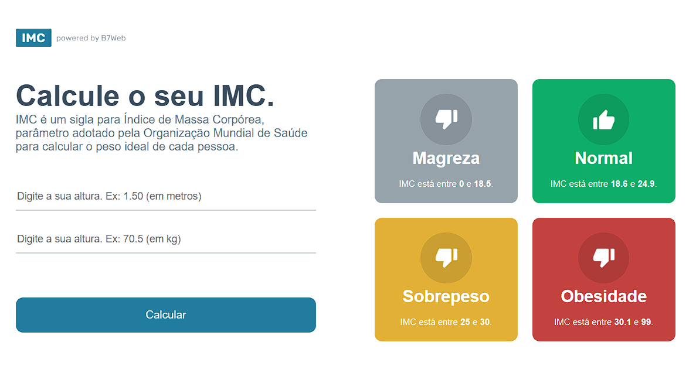

# Calculadora de IMC

Projeto realizado em React (Vite) + Typescript fazendo uma calculadora de IMC.

Projeto desenvolvido durante o curso da B7Web.

 

## Link do projeto:
### [Acesse aqui!](https://calculadora-j2a2e6jqw-guilherme-goncalves-de-souza.vercel.app/)

 

 

#### Instalação caso queira instalar:
- `npm install` 

#### Para rodar:
- `npm run dev` 

 

 

